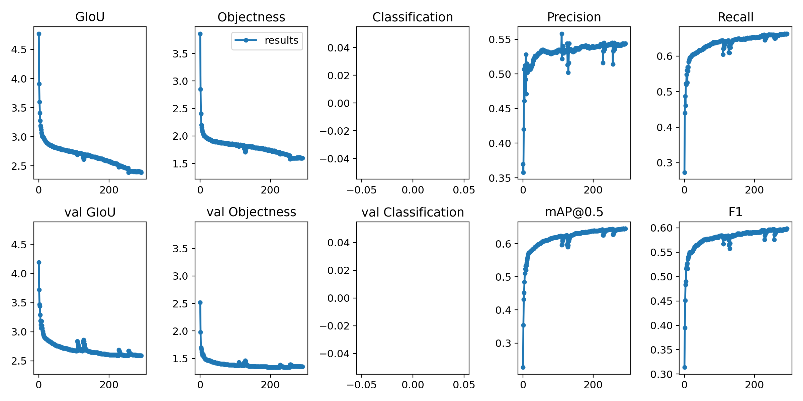

# Project for COMP9517

## Tasks
### Task 1
- The system will report:
    - The unique number of pedestrians detected 
    - The path followed by each pedestrian

### Task 2
1. Program will ask you to draw the bounding box
1. After drawing the bounding box, press Enter
1. The system will report:
    - Pedestrians who enter the bounding box
    - Pedestrians who move out of the bounding box

### Task 3
- The system will report:
    - The number of pedestrians in group.
    - The number of pedestrians not in group.
    
 

## How to run:
1. Run download pre-trained weights (.pt file) from [grdive](https://drive.google.com/open?id=1QjZeCVzdMXl9RbR4bnHiqGPVS2zVtxtr) and put them in weights directory.
1. Place all images in following path -> Group_Component/sequence/*.jpg
1. Download ckpt.t7 from [gdrive](https://drive.google.com/open?id=1QjZeCVzdMXl9RbR4bnHiqGPVS2zVtxtr) and place in deep_sort directory
1. Run `python TaskSolver.py --task <TASK_NUMBER>`
1. Check `python TaskSolver.py -h` for other custom arguments

## Weights
our weights was trainned with COCO_2017 dataset with only person class (64,115 images).

## Results
With 300 epochs, we got mAP 0.644

## References
- This project uses YOLOv3-SPP model to detect pedestrians, as implemented by [ultraltyics team](https://github.com/ultralytics/yolov3).
- Deepsort implemented by [ZQPei](https://github.com/ZQPei/deep_sort_pytorch) to track pedestrians.
